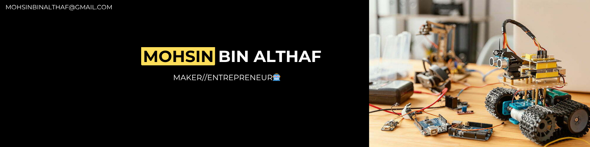

  

# Mohsin here 👋

I build things across embedded systems, robotics, 
and software — from PCB design to web interfaces & Ebike Build

Hosted 5 National Hackathons
3X time International Hackathon winner
Maker of the year 2021 Kerala Startup Mission

## Skills

**Embedded & Hardware**

**Robotics & Simulation**

**Software & Tools**

## What I work on

- Robotics and autonomous systems
- Custom PCB design and embedded firmware
- IoT builds and hardware prototypes
- Game development and interactive interfaces

  

---

*Always building something new.*
     

  

 

<a href="mailto:">uamohsin.5@gmail.com</a>/<a href="https://instagram.com/mohsinbinaltaf___">mohsinbinalthaf___</a>

